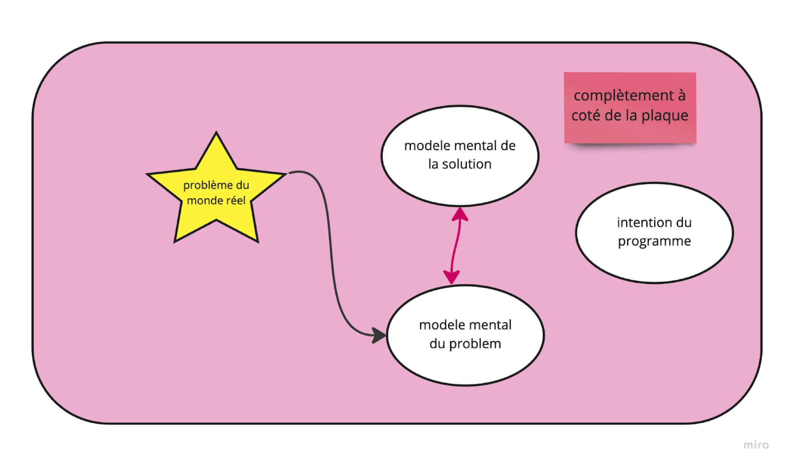

[Dans un article de 2014](https://syounggallery.wordpress.com/2014/11/03/why-your-code-is-so-hard-to-understand/), Stephen Young nous explique les causes de la complexité (et de la non adéquation) du code que nous écrivons.

Il pointe du doigt les causes racines du code mal écrit.

Il tente de résumer sa pensée comme ceci:

```
In order to solve any real world problem we first need to form a mental model of that problem.

Think of this as the intent of your program.

Next you need to form a model of a solution that will achieve your programs intent.

Let's call this the semantic model. Never confuse the intent of your program with your solution to that intent.

We tend to think primarily in terms of solutions, and often bypass the formation of a model of intent.

```

Anthony Cassaigne m’a interpellé sur la signification (profonde) de ce paragraphe, qui reste c’est vrai assez mystérieux pour nous.

Tout propos étant soumis à interprétation, je me suis fendu d’une petite succession de schémas qui me sont venus à l’esprit pour tenter d’éclaircir ma propre vision sur la chose.

J’ai donc repris les concepts distincts de: modèle mental du problème, modèle mental de la solution et intention du programme.

Pour éclaircir la suite, je vais en donner ma propre interprétation.

Parlons d’abord de l’intention du programme: pas facile à définir  et ma proposition sera critiquable. Jean Pascal Boignard me pose la question: est ce que l’intention du programme serait “_la somme des fonctions que réalise un programme qui visent à offrir une solution à tout ou partie d'un problème avec plus ou moins de qualité_“ ?

Cette définition me plait bien, et je rajouterai que cette intention est aussi (et surtout) la somme des tests qui couvrent le code, car avec le TDD, qu’ils soient unitaires ou d’intégration ou d’acceptance, les tests révèlent par l’explicitation du comportement attendu et observable, l’intention du programme.

Parlons ensuite des modèles mentaux.

L’intérêt de l'existence d’un [modèle mental ](https://www.scotthyoung.com/blog/2020/06/08/best-mental-models/)est de pouvoir le partager avec les autres, et donc de l’écrire (d’où émergence de la problématique du langage) et/ou de le schématiser, le formaliser.

Le modèle mental du problème est la façon dont on va se représenter l’espace du problème. La séparation des espaces de problème et de solution se retrouve dans les approches du  [Design Thinking](https://medium.com/@raffaele.bagalini/la-premi%C3%A8re-%C3%A9tape-du-design-thinking-1df387bf3cd4) par exemple, et dans le DDD bien sûr.

Le modèle mental de la solution est la même chose mais destiné à ceux qui veulent solutionner le problème (ou besoin) initial. DDD a toutes les cartes en mains pour nous aider à établir un modèle mental de la solution avec sa [panoplie stratégique et tactique](https://vaadin.com/blog/ddd-part-1-strategic-domain-driven-design).

Je cite l’article de Vaadin:

```

Vaughn Vernon splits a domain up into a problem space and a solution space. The problem space concentrates on what business problems we are trying to solve. (...)

The solution space concentrates on how the problems in the problem space are going to be solved. It is more concrete, more technical and contains more details.

```

Les usagers et experts du Domaine parlent le langage du Domaine, un langage naturel (humain) riche en ambiguïtés et jargonnage, reflétant les us et coutumes de tel métier.

Les artisans de la solution (logicielle) se doivent d’établir avec les acteurs du domaine, une co-construction de ce langage du domaine qui sera appelé _Ubiquitous Language_ par Eric Evans, car il devra être compris par toutes les parties prenantes, et devra chasser tous les implicites.

```
Domain experts should object to terms or structures that are awkward or inadequate to convey domain understanding; developers should watch for ambiguity or inconsistency that will trip up design.

-- Eric Evans
```

[Martin Fowler cite Evans](https://martinfowler.com/bliki/UbiquitousLanguage.html) pour expliquer ce que l’on attend du langage omniprésent.

Ces 3 concepts étant éclaircis, j’ai voulu raconter une histoire, souvent vécue, de ce qui se joue dans les équipes, entre modèle de l’espace du problème, modèle de l’espace de la solution et code mis en production.


### Acte 1: personne ne se parle





Bon nombre de projets commencent ainsi: les experts du domaine n’ont pas fini d’explorer l’espace du problème ou ne sont pas encore capable de l’expliciter avec des éléments suffisamment tangibles; ou encore: la vision du produit à livrer n’est vraiment pas mûre (je n’ai jamais dit que l’on ne pouvait pas vivre avec cette incertitude, au contraire).

L’équipe de dev décide de son côté d’imaginer un espace de la solution rêvée, et même elle produit du code pour se faire plaisir (ou se former) côté techno et infrastructures (exemple typique: “_et si on commençait par installer une base de données_”). Après tout, on nous paye pour coder, alors il faut bien justifier son salaire...


### Acte 2: les devs ont commencé à coder la solution sans questionner le métier


Mais l’équipe a progressé; ils ont aligné une partie du code avec l’espace de la solution.

C’est un grand pas en avant, et pour cela ils ont utilisé les principes [tactiques](https://vaadin.com/blog/ddd-part-2-tactical-domain-driven-design) que nous dévoile le DDD: penser en agrégats, entités, objets valeurs, immutabilité, event driven, [architecture hexagonale](https://vaadin.com/blog/ddd-part-3-domain-driven-design-and-the-hexagonal-architecture), noyau fonctionnel (functionnal core) et enveloppe impérative (imperative shell): [un concept vieux de 10 ans maintenant](https://github.com/kbilsted/Functional-core-imperative-shell/blob/master/README.md). \
Ils sont, je pense, sur une partie de la bonne voie, MAIS, ils n’ont toujours pas parlé aux experts métier. Ou pas suffisamment. Leurs 2 mondes restent dangereusement disjoints.


### Acte 3: enfin le métier et les devs se sont parlé, mais le code produit n'est toujours pas (assez) aligné avec le métier


C’est normal, Rome ne s’est pas faite en un jour.

Peut-être auraient-ils dû commencer par participer aux Event Stormings et autres ateliers du [DDD stratégique](https://www.goodreads.com/book/show/15756865-implementing-domain-driven-design).

Néanmoins, les devs ont questionné le modèle mental de la solution et le rapprochent (au travers de l’Ubiquitous Language, mais pas que) du modèle mental de la solution.

Il faut encore que l’intention du programme se fusionne avec tout cela.

Et ce qui permet de révèler l’intention, c’est d'établir un comportement attendu, explicite, vérifiable, discret, qui s’écrit sous forme de tests unitaires.
Heureusement, ils ont fait du TDD et leur batterie de tests leur permet d’effectuer un [refactoring qui va les rapprocher du domaine métier](https://www.youtube.com/watch?v=_dQRAsVhCqA).
Les espaces du problème, de la solution et le code qui part en production, se mettent à converger!


### Acte 4: on se comprend mieux; le modèle mental du problème et de la solution fusionnent et l'intention du code reflète cela.


Il y a encore du travail, mais les choses avancent.

L’équipe est en confiance, son code reflète bien mieux sa représentation mentale de la solution, qui elle même s’aligne avec l’expertise du métier.

Et tout cela s’auto entretient [comme ceci](https://www.domainlanguage.com/ddd/whirlpool/):


### Acte 5: un final?

Le monde a ses limites, cela ne sera jamais parfait.


Je pense qu’une réalisation discrète d’un problème continu sera toujours imparfaite.

Il faut savoir vivre avec celà et malgré tout, prendre plaisir à faire partie de la solution :)

```

PS: je vous parlerai des méta-modèles dans un tout prochain article. stay tuned.

```

Et je laisse la conclusion à Jean Pascal Boignard:

_En somme, ce modèle d'ensemble aide à questionner l'efficience des activités de développement logiciel via la convergence de ses représentations; à révéler ses gaspillages, et peut inviter à une réflexion éthique plus large par la clarification des intentions et intérêts des parties prenantes._
